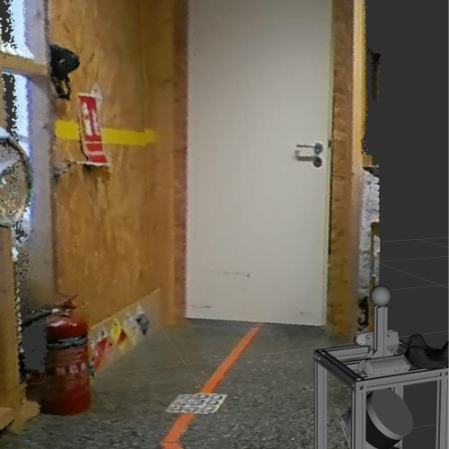
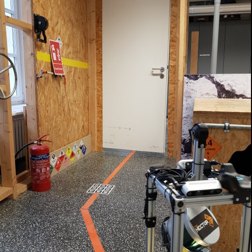

# color_cloud_from_image

This ROS package colorizes 3D Lidar point clouds from 360° camera data. A guide and demo configuration will follow shortly.

| Colored cloud | Reference Image |
|--|--|
|  |  |

